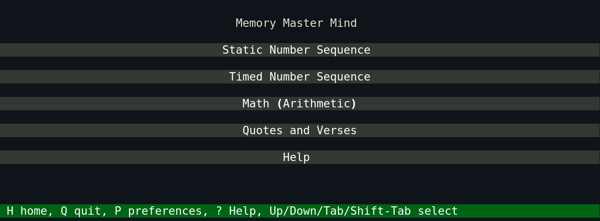
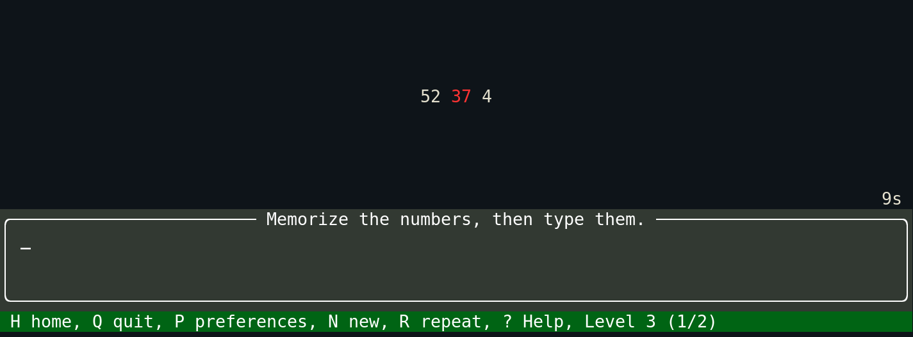
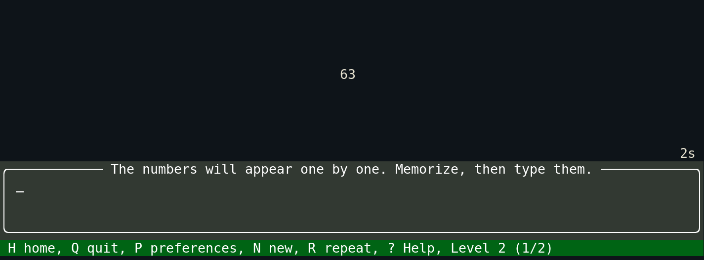
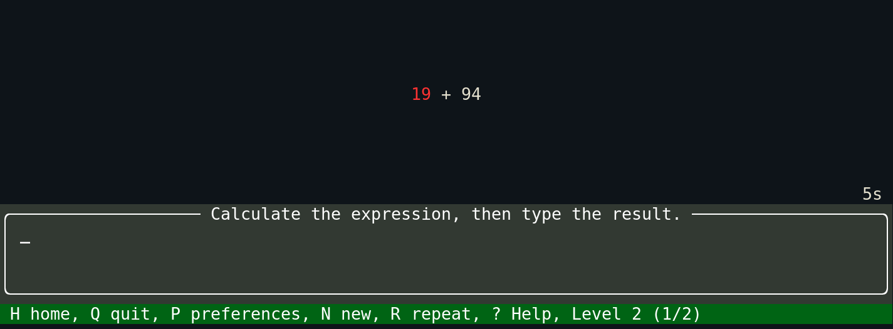
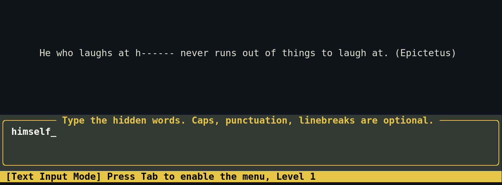
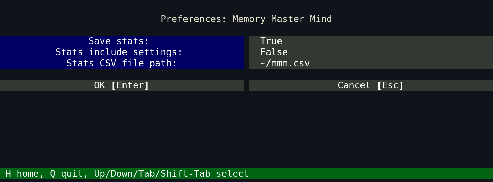
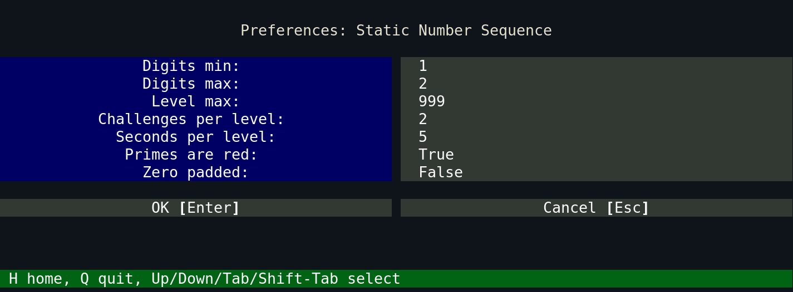

# MMM - Memory Master Mind

Memory training in the terminal

Install with pip:

``` shell
pip install memory-master-mind
```

Run with the `mmm` command.

## Help and Challenges Info

- [App Help](mmm/assets/mmm_help.md)
- [Static Number Sequence](mmm/assets/static_number_sequence.md)
- [Timed Number Sequence](mmm/assets/timed_number_sequence.md)
- [Math (Arithmetic)](mmm/assets/math_arithmetic.md)
- [Quotes and Verses](mmm/assets/quotes_and_verses.md)











## Preferences





## Links

Powered by the [textual](https://github.com/Textualize/textual) TUI framework

<https://github.com/profound-labs/memory-master-mind>
